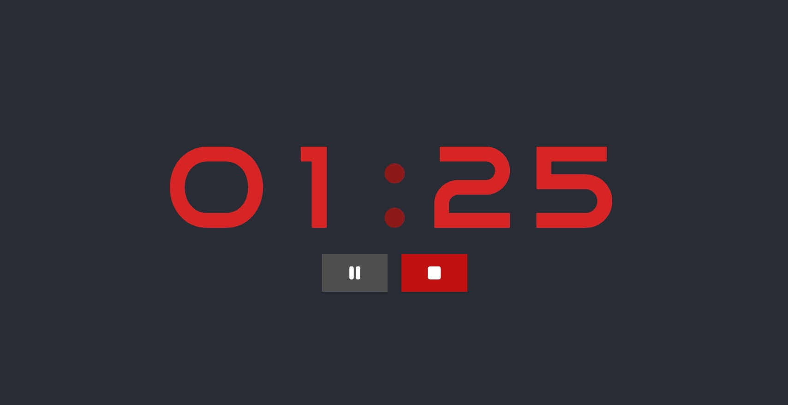

# Starter React Projects

A collection of simple React projects. The purpose of this project is to learn React by making simple apps and in the process, also learn important concepts about code modularity and re-usability, project structuring, and documentation.

## Projects

1. [StopWatch](#stopwatch)

## StopWatch

A simple **StopWatch** app which has a *Start*, *Pause* and *Stop* feature. It can count only upto an hour after which it resets itself to 0 minutes and 0 seconds.

The following is a sample screen from the app when it is stopped:

The following is a sample screen from the app when it is running:

