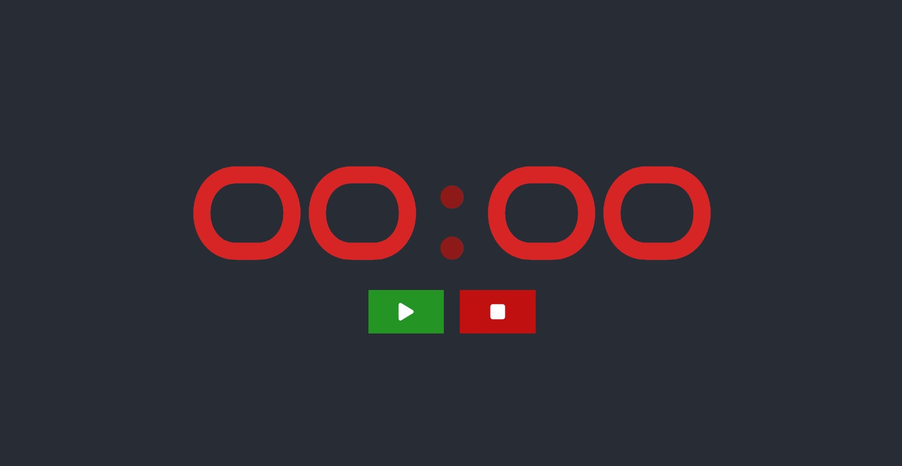
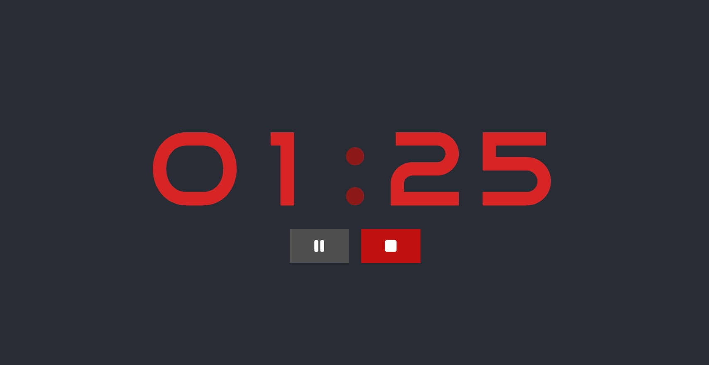
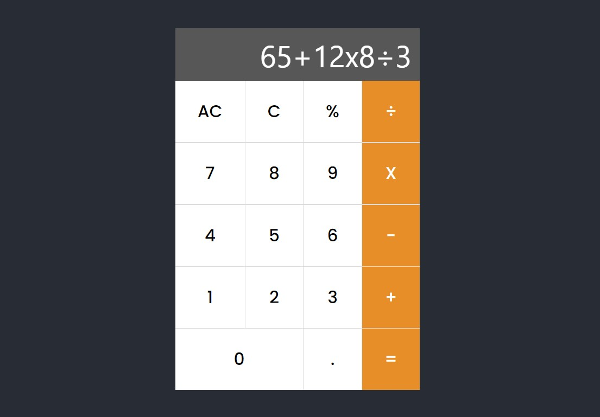
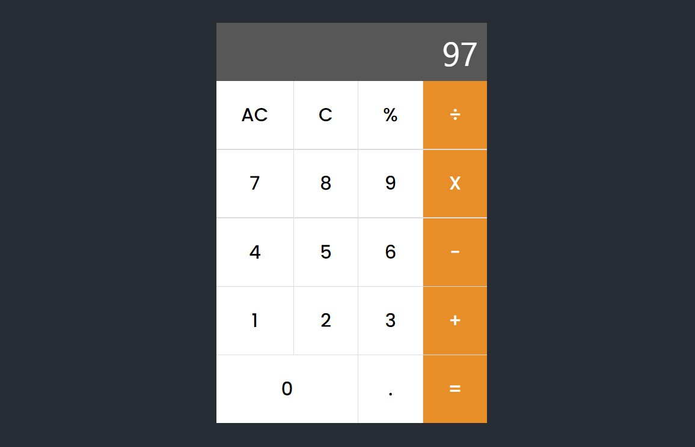

# Starter React Projects

A collection of simple React projects. The purpose of this project is to learn React by making simple apps and in the process, also learn important concepts about code modularity and re-usability, project structuring, and documentation.

## Projects

1. [StopWatch](#stopwatch)
2. [Calculator](#calculator)

## StopWatch

A simple **StopWatch** app which has a *Start*, *Pause* and *Stop* feature. It can count only upto an hour after which it resets itself to 0 minutes and 0 seconds.

#### Sample Screenshots

The following is a sample screen from the app when it is stopped:

The following is a sample screen from the app when it is running:

## Calculator

A **Calculator** app which has the basic functionalities like *Addition*, *Subtraction*, *Multiplication*, *Division*, and *Modulus* (Remainder when performing division).

It supports numbers only upto what is visible on the screen. If the numbers overflow from the display area of the calculator, then it cannot be scrolled. So it is recommended to break up the calculation into smaller parts so that at any point of time, all the digits which are to be displayed, are actually fitting in the screen. The calculation will still be performed correctly, whether the numbers are visible or not, but it is just an inconvenience to not being able to see the entirety of what we are calculating.

Also, this app supports **keyboard inputs**! Just click on the app area once to focus it. Then the keyboard inputs work for all the keys of the calculator.

#### Keyboard Mappings

Calculator Keys    | Keyboard Keys
-------------------|--------------
Numbers (0-9)      | 0-9 (Numeric Keys)
Decimal Point (.)  | .
Equals (=)         | =
Addition (+)       | +
Subtraction (-)    | -
Multiplication (X) | *
Division (÷)       | /
Modulus (%)        | %
Clear (C)          | Backspace
All Clear (AC)     | Delete

#### Sample Screenshots

A sample calculation:

And it's corresponding answer:

