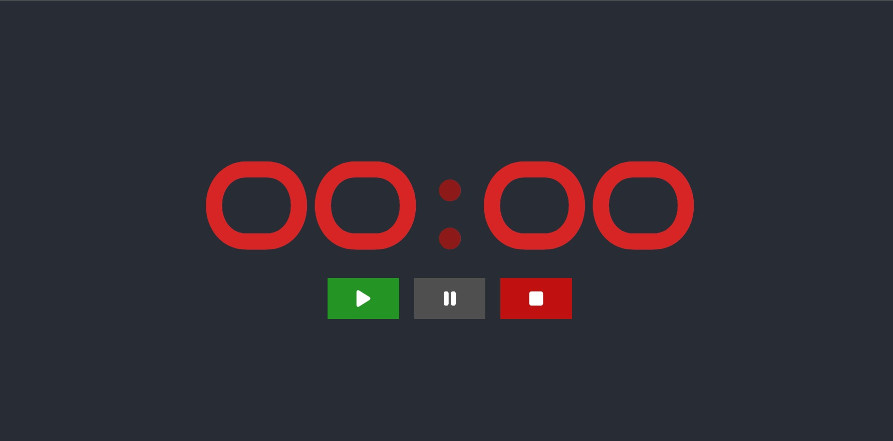

# Simple Stopwatch using React

A simple **StopWatch** app built using React. The app has a *Start*, *Pause* and *Stop* feature. It can count only upto an hour after which it resets itself to 0 minutes and 0 seconds.

The following is a sample screen from the app:

